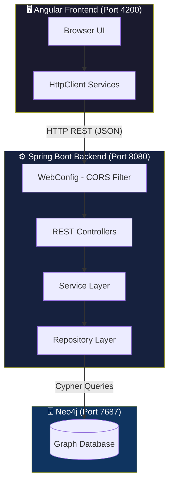
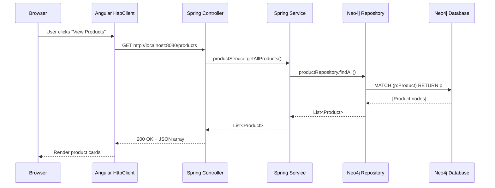
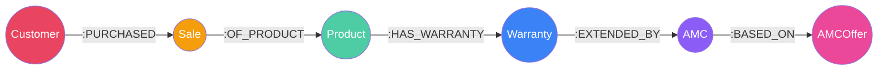

# 🚀 PSPL — Post-Sale Product Lifecycle & AMC Management System

> A full-stack web application for tracking **products**, **sales**, **warranties**, and **Annual Maintenance Contracts (AMCs)** across their entire lifecycle — powered by a Neo4j graph database.

---

## 📖 Table of Contents

- [Introduction](#-introduction)
- [Tech Stack](#-tech-stack)
- [System Architecture](#-system-architecture)
- [Database Schema](#-database-schema)
- [Project Structure](#-project-structure)
- [REST API Endpoints](#-rest-api-endpoints)
- [Setup Instructions](#-setup-instructions)
- [Running the Application](#-running-the-application)
- [FAQ](#-faq)

---

## 🧩 Introduction

**What problem does this solve?**

When a company sells products, the story doesn't end at the cash register. There's a whole *post-sale lifecycle* to manage:

1. **Who** bought the product? → `Customer`
2. **When** was it sold? → `Sale`
3. **What** was sold? → `Product`
4. **How long** is it covered? → `Warranty`
5. **What happens** when the warranty expires? → `AMC` (Annual Maintenance Contract)
6. **What plan** does the AMC follow? → `AMCOffer` (Silver, Gold, etc.)

These entities are deeply **interconnected** — a customer purchases a sale, which contains products, which have warranties, which can be extended by AMCs based on specific offers. This is a *graph problem*, and that's exactly why we use a graph database.

This project provides:
- A **Spring Boot REST API** that manages all of these entities
- An **Angular frontend** with a fixed layout (navbar + sidebar + scrollable content) for browsing products and expiring warranties
- **Neo4j** as the database, storing entities as nodes and their connections as relationships

---

## 🛠 Tech Stack

| Layer | Technology | Why? |
|-------|-----------|------|
| **Backend** | Spring Boot 4.0 + Java 25 | Industry-standard framework for building REST APIs. Spring's dependency injection and auto-configuration make setup effortless. |
| **Database** | Neo4j (via Spring Data Neo4j) | Our data is all about *relationships* — customers own sales, products have warranties, warranties link to AMCs. A graph database models this naturally, unlike relational tables that need complex JOINs. |
| **ORM** | Spring Data Neo4j (SDN) | Provides `Neo4jRepository` with built-in CRUD plus custom Cypher queries via `@Query`. No need to manage raw driver sessions. |
| **Frontend** | Angular 21 (Standalone Components) | Modern component-based SPA framework with signals, lazy-loaded routes, and built-in HttpClient for API communication. |
| **Build** | Maven (backend) + npm (frontend) | Standard build tools for Java and TypeScript respectively. |
| **Code Gen** | Lombok | Eliminates boilerplate getters/setters/constructors on Java model classes. |

---

## 🏗 System Architecture



### How a request flows through the system:



---

## 🗂 Database Schema

Our Neo4j graph has **6 node types** connected by **5 relationship types**:



### Node Properties

```
┌──────────────────────────────────────────────────────────┐
│  Customer                                                │
│  ├── custId: String (auto-generated)                     │
│  └── custName: String                                    │
├──────────────────────────────────────────────────────────┤
│  Sale                                                    │
│  ├── saleId: String (auto-generated)                     │
│  └── saleDate: LocalDate                                 │
├──────────────────────────────────────────────────────────┤
│  Product                                                 │
│  ├── productId: String (auto-generated)                  │
│  ├── productName: String                                 │
│  └── productSerialNumber: String                         │
├──────────────────────────────────────────────────────────┤
│  Warranty                                                │
│  ├── warrantyId: String (auto-generated)                 │
│  ├── warrantyStartDate: LocalDate                        │
│  └── warrantyEndDate: LocalDate                          │
├──────────────────────────────────────────────────────────┤
│  AMC                                                     │
│  ├── amcId: String (auto-generated)                      │
│  ├── amcStartDate: LocalDate                             │
│  └── amcEndDate: LocalDate                               │
├──────────────────────────────────────────────────────────┤
│  AMCOffer                                                │
│  ├── offerId: String (auto-generated)                    │
│  ├── offerType: String (Silver / Gold)                   │
│  ├── offerDurationMonths: Integer                        │
│  ├── offerPrice: Double                                  │
│  └── offerTerms: String                                  │
└──────────────────────────────────────────────────────────┘
```

### Relationship Chain (read it like a sentence)

> A **Customer** `PURCHASED` a **Sale**, which is `OF_PRODUCT` a **Product**, which `HAS_WARRANTY` a **Warranty**, which can be `EXTENDED_BY` an **AMC**, which is `BASED_ON` an **AMCOffer**.

---

## 📁 Project Structure

```
amcProject/
├── pom.xml                              # Maven build config
├── src/main/java/com/postSale/amcProject/
│   ├── AmcProjectApplication.java       # Spring Boot entry point
│   ├── config/
│   │   └── WebConfig.java               # CORS configuration
│   ├── controllers/                     # REST API endpoints
│   │   ├── CustomerController.java
│   │   ├── ProductController.java
│   │   ├── SaleController.java
│   │   ├── WarrantyController.java
│   │   ├── AMCController.java
│   │   └── AMCOfferController.java
│   ├── Services/                        # Business logic
│   │   ├── CustomerService.java
│   │   ├── ProductService.java
│   │   ├── SaleService.java
│   │   ├── WarrantyService.java
│   │   ├── AMCService.java
│   │   └── AMCOfferService.java
│   ├── Repositories/                    # Neo4j data access
│   │   ├── CustomerRepository.java
│   │   ├── ProductRepository.java
│   │   ├── SaleRepository.java
│   │   ├── WarrantyRepository.java
│   │   ├── AMCRepository.java
│   │   └── AMCOfferRepository.java
│   ├── Model/nodes/                     # Neo4j node entities
│   │   ├── Customer.java
│   │   ├── Product.java
│   │   ├── Sale.java
│   │   ├── Warranty.java
│   │   ├── AMC.java
│   │   └── AMCOffer.java
│   └── Exceptions/                      # Error handling
│       ├── GlobalExceptionHandler.java
│       └── ResourceNotFoundException.java
│
├── frontend/                            # Angular application
│   ├── src/app/
│   │   ├── app.ts / app.html / app.css  # Root shell component
│   │   ├── app.config.ts                # Providers (HttpClient, Router)
│   │   ├── app.routes.ts                # Lazy-loaded route definitions
│   │   ├── models/                      # TypeScript interfaces
│   │   ├── services/                    # HttpClient API services
│   │   ├── layout/                      # Navbar + Sidebar
│   │   └── pages/                       # Home, ProductCreate, ProductDetail, About, Contact, Profile
│   └── src/environments/               # API base URL config
```

---

## 🌐 REST API Endpoints

### Customers (`/customers`)
| Method | Path | Description |
|--------|------|-------------|
| `POST` | `/customers` | Create a new customer |
| `GET` | `/customers` | List all customers |
| `GET` | `/customers/{id}` | Get customer by ID |
| `PUT` | `/customers` | Update a customer |
| `DELETE` | `/customers/{id}` | Delete a customer |

### Products (`/products`)
| Method | Path | Description |
|--------|------|-------------|
| `POST` | `/products` | Create a new product |
| `GET` | `/products` | List all products |
| `GET` | `/products/{id}` | Get product by ID |
| `PUT` | `/products` | Update a product |
| `DELETE` | `/products/{id}` | Delete a product |

### Sales (`/sales`)
| Method | Path | Description |
|--------|------|-------------|
| `POST` | `/sales` | Create a new sale |
| `GET` | `/sales/{id}` | Get sales by customer ID |

### Warranties (`/warranty`)
| Method | Path | Description |
|--------|------|-------------|
| `GET` | `/warranty` | Get all warranties expiring within 30 days |
| `GET` | `/warranty/{id}` | Get warranties by customer ID |

### AMCs (`/amcs`)
| Method | Path | Description |
|--------|------|-------------|
| `POST` | `/amcs` | Create a new AMC |
| `GET` | `/amcs` | List all AMCs |
| `GET` | `/amcs/{id}` | Get AMC by ID |
| `PUT` | `/amcs` | Update an AMC |
| `DELETE` | `/amcs/{id}` | Delete an AMC |

### AMC Offers (`/amc-offers`)
| Method | Path | Description |
|--------|------|-------------|
| `POST` | `/amc-offers` | Create a new offer |
| `GET` | `/amc-offers` | List all offers |
| `GET` | `/amc-offers/{id}` | Get offer by ID |
| `PUT` | `/amc-offers` | Update an offer |
| `DELETE` | `/amc-offers/{id}` | Delete an offer |

---

## ⚡ Setup Instructions

### Prerequisites

Make sure you have these installed:

| Tool | Version | Download |
|------|---------|----------|
| **Java JDK** | 25+ | [Oracle JDK](https://www.oracle.com/java/technologies/downloads/) |
| **Maven** | 3.9+ | [Maven](https://maven.apache.org/download.cgi) (or use the included `mvnw`) |
| **Node.js** | 20+ | [Node.js](https://nodejs.org/) |
| **Neo4j** | 5.x | [Neo4j Desktop](https://neo4j.com/download/) or [Neo4j Aura](https://neo4j.com/cloud/aura/) |

### Step 1: Start Neo4j

**Option A — Neo4j Desktop (Local)**
1. Download and install [Neo4j Desktop](https://neo4j.com/download/)
2. Create a new project → Add a Database → Start it
3. Note the **Bolt URL** (usually `bolt://localhost:7687`), **username** (`neo4j`), and **password** (you set this)

**Option B — Neo4j Aura (Cloud)**
1. Go to [Neo4j Aura](https://neo4j.com/cloud/aura/) and create a free instance
2. Copy the connection URI, username, and password

### Step 2: Configure the Backend

Set your Neo4j credentials as environment variables:

```bash
# Windows PowerShell
$env:NEO4J_URI = "bolt://localhost:7687"
$env:NEO4J_USERNAME = "neo4j"
$env:NEO4J_PASSWORD = "your-password-here"

# macOS / Linux
export NEO4J_URI=bolt://localhost:7687
export NEO4J_USERNAME=neo4j
export NEO4J_PASSWORD=your-password-here
```

> 💡 **Tip:** These map to the `${NEO4J_URI}`, `${NEO4J_USERNAME}`, and `${NEO4J_PASSWORD}` placeholders in `application.properties`.

### Step 3: Start the Backend

```bash
# From the project root directory
./mvnw spring-boot:run

# Or on Windows
mvnw.cmd spring-boot:run
```

The API will be available at **http://localhost:8080**.

Test it with:
```bash
curl http://localhost:8080/products
```

### Step 4: Install Frontend Dependencies

```bash
cd frontend
npm install
```

### Step 5: Start the Frontend

```bash
npm start
```

The Angular app will be available at **http://localhost:4200**.

---

## 🏃 Running the Application

Once everything is running, you should have:

| Service | URL | Description |
|---------|-----|-------------|
| **Neo4j Browser** | http://localhost:7474 | Visual database explorer |
| **Spring Boot API** | http://localhost:8080 | REST API |
| **Angular Frontend** | http://localhost:4200 | Web UI |

Open **http://localhost:4200** in your browser. You'll see:
- A **fixed navbar** at the top with navigation links
- A **collapsible sidebar** on the left showing your products and expiring warranties
- A **scrollable main content area** with product/warranty cards, search, and pagination

---

## ❓ FAQ

**Q: Why Neo4j instead of PostgreSQL/MySQL?**
> Our data is fundamentally about *relationships*. Querying "find all warranties for all products in all sales for a specific customer" in SQL would require 4 JOINs. In Neo4j, it's a single `MATCH` traversal that reads like English.

**Q: What's the difference between SDN and the Neo4j Driver?**
> **Spring Data Neo4j (SDN)** is the ORM layer we use — it maps Java classes to Neo4j nodes using annotations like `@Node` and `@Relationship`. The **Neo4j Java Driver** is the lower-level transport that SDN uses internally to send Cypher queries over the Bolt protocol. We get the best of both worlds: simple `save()`/`findAll()` for basic CRUD, and custom `@Query` annotations for complex traversals.

**Q: Why Angular 21 with Standalone Components?**
> Standalone components (no NgModules) are the modern Angular pattern. Combined with signals for reactive state and `loadComponent` for lazy loading, this gives us a clean, performant, and maintainable frontend.

**Q: Why is there a CORS configuration?**
> The frontend (port 4200) and backend (port 8080) are on different origins. Browsers block cross-origin requests by default for security. Our `WebConfig.java` tells Spring to allow requests from `http://localhost:4200`.

---

<p align="center">
  Built with ❤️ using Spring Boot, Neo4j, and Angular
</p>


