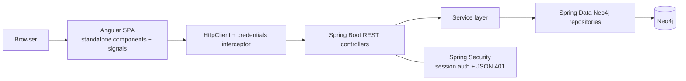
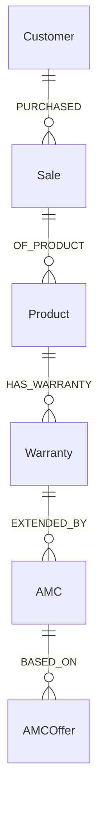

# PSPL - Post-Sale Product Lifecycle & AMC Management System

PSPL is a full-stack application for tracking products, customers, sales, warranties, AMC contracts, and AMC offers across a post-sale lifecycle. It helps teams see how a sale connects to a product, how that product maps to warranty coverage, and how AMCs extend that coverage. The application is intended for users who need a graph-based view of post-sale support data.

---

## Overview

PSPL is built as an Angular frontend, a Spring Boot REST backend, and a Neo4j graph database. The backend exposes authentication and domain APIs, the frontend consumes them through typed HttpClient services, and Neo4j stores the business objects as nodes with relationships between them.

The business problem it addresses is post-sale tracking: who bought what, when it was sold, what warranty exists, when that warranty expires, and which AMC plans can extend it. The graph model matches that relationship-heavy domain better than a flat table design.

Frontend communication uses session cookies. `credentials.interceptor.ts` adds `withCredentials: true` to every request, `AuthService` restores sessions on app startup, and Spring Security uses server-side sessions. The app also includes Angular SSR/client hydration configuration and an Express-based SSR entry point.

---

## Features

### Authentication

- Sign up with name, email, and password validation
- Sign in with email and password
- Restore the active session on app startup
- Sign out and destroy the server session
- Request a password reset email
- Reset the password with a time-limited token
- Prevent duplicate signup emails

### Product Management

- Create products
- List all products
- View product details
- Update products
- Delete products
- Show associated warranties on the product detail page

### Customer Management

- Create customers
- List all customers
- View customers by ID
- Update customers
- Delete customers

### Sales

- Create sales
- List sales by customer ID

### Warranty Tracking

- List warranties expiring within 30 days
- List warranties by customer ID

### AMC Management

- Create AMCs
- List AMCs
- View AMCs by ID
- Update AMCs
- Delete AMCs

### AMC Offer Management

- Create AMC offers
- List AMC offers
- View AMC offers by ID
- Update AMC offers
- Delete AMC offers

### Dashboard and Navigation

- Home page with product and warranty cards
- Client-side search for products and warranties
- Client-side pagination for products and warranties
- Collapsible sidebar
- Navbar that changes based on authentication state
- Profile page showing the signed-in user
- About and contact pages

### Security and Routing

- Protected routes for authenticated users
- Guest-only routes for login, signup, and forgot password
- SPA route forwarding for browser refresh on Angular routes
- JSON 401 response for unauthenticated API access

---

## Tech Stack

| Category | Technology | Version |
|---|---|---:|
| Backend | Spring Boot | 4.0.2 |
| Backend | Spring WebMVC | 4.0.2 |
| Backend | Spring Security | 4.0.2 |
| Backend | Spring Data Neo4j | 4.0.2 |
| Backend | Spring Validation | 4.0.2 |
| Backend | Spring Mail | 4.0.2 |
| Backend | Lombok | TODO |
| Frontend | Angular | 21.2.0 |
| Frontend | Angular SSR | 21.2.0 |
| Frontend | TypeScript | 5.9.2 |
| Frontend | RxJS | 7.8.0 |
| Frontend | Express | 5.1.0 |
| Frontend | Vitest | 4.0.8 |
| Database | Neo4j | TODO |
| Build Tool | Maven | TODO |
| Build Tool | npm | 11.10.0 |

---

## Project Architecture

The application follows a layered architecture:



The frontend is configured for SSR and client hydration, and `frontend/src/server.ts` provides an Express SSR entry point.

---

## Folder Structure

```text
PSPLProject/
├── pom.xml
├── src/
│   ├── main/
│   │   ├── java/com/postSale/amcProject/
│   │   │   ├── controllers/
│   │   │   ├── Services/
│   │   │   ├── Repositories/
│   │   │   ├── Model/
│   │   │   │   ├── dto/auth/
│   │   │   │   └── nodes/
│   │   │   ├── config/
│   │   │   └── Exceptions/
│   │   └── resources/
│   └── test/
└── frontend/
    ├── angular.json
    ├── package.json
    └── src/
        ├── app/
        │   ├── guards/
        │   ├── interceptors/
        │   ├── layout/
        │   ├── models/
        │   ├── pages/
        │   └── services/
        ├── environments/
        ├── main.ts
        ├── main.server.ts
        └── server.ts
```

| Folder | Purpose |
|---|---|
| `src/main/java/.../controllers` | REST API entry points for auth, products, customers, sales, warranties, AMCs, and AMC offers. |
| `src/main/java/.../Services` | Business logic, transactional boundaries, token handling, and email dispatch. |
| `src/main/java/.../Repositories` | Spring Data Neo4j repositories and custom Cypher queries. |
| `src/main/java/.../Model/nodes` | Neo4j node entities. |
| `src/main/java/.../Model/dto/auth` | Auth request and response DTOs with validation annotations. |
| `src/main/java/.../config` | CORS, security, SPA forwarding, and JSON auth entry point configuration. |
| `src/main/java/.../Exceptions` | Shared exception classes and global REST error handling. |
| `frontend/src/app/layout` | Shared navbar and sidebar components. |
| `frontend/src/app/pages` | Route-level pages such as home, login, signup, product detail, and profile. |
| `frontend/src/app/services` | Typed API clients for backend endpoints. |
| `frontend/src/app/models` | Frontend TypeScript interfaces that mirror backend payloads. |
| `frontend/src/app/guards` | Route guards for authenticated and guest-only pages. |
| `frontend/src/app/interceptors` | HTTP interceptor that attaches cookies to requests. |
| `frontend/src/environments` | Environment-specific API base URL settings. |
| `frontend/src/server.ts` | Express SSR server entry point. |
| `src/main/java/.../Model/Relationships` | Commented relationship-property prototypes; not used by the running app. |

---

## Backend Architecture

### Controllers

The controllers expose JSON REST endpoints:

- `AuthController` handles signup, login, session lookup, logout, forgot password, and reset password.
- `ProductController`, `CustomerController`, `SaleController`, `WarrantyController`, `AMCController`, and `AMCOfferController` expose domain endpoints.

### Services

Services hold the business rules and transaction boundaries. They:

- save and update Neo4j nodes
- check existence before updates/deletes
- hash passwords with BCrypt
- generate password reset tokens
- send reset emails or log reset URLs when mail is not configured

### Repositories

Repositories extend `Neo4jRepository`. Most are CRUD-only; the notable custom queries are:

- `SaleRepository.findAllSalesByCustomerId(...)`
- `WarrantyRepository.findWarrantiesExpiringSoon()`
- `WarrantyRepository.findWarrantiesByCustomerId(...)`

### Models

The graph model uses `@Node` entities:

- `User`
- `Customer`
- `Sale`
- `Product`
- `Warranty`
- `AMC`
- `AMCOffer`

Relationships are declared with `@Relationship` fields:

- `Customer` - `PURCHASED` -> `Sale`
- `Sale` - `OF_PRODUCT` -> `Product`
- `Product` - `HAS_WARRANTY` -> `Warranty`
- `Warranty` - `EXTENDED_BY` -> `AMC`
- `AMC` - `BASED_ON` -> `AMCOffer`

### DTOs

Auth requests and responses are implemented as Java records:

- `SignupRequest`
- `LoginRequest`
- `ForgotPasswordRequest`
- `ResetPasswordRequest`
- `AuthResponse`
- `AuthUserResponse`
- `MessageResponse`

The request DTOs use Bean Validation annotations such as `@NotBlank`, `@Email`, and `@Size`.

### Exception Handling

`GlobalExceptionHandler` converts common exceptions into JSON responses with `timestamp`, `status`, `error`, and `message`. It handles:

- `ResourceNotFoundException`
- `IllegalArgumentException`
- `MethodArgumentNotValidException`
- `NoSuchElementException`
- uncaught `Exception`

### Configuration

- `SecurityConfig` enables session-based auth, disables form login and HTTP basic auth, and marks business endpoints as protected.
- `WebConfig` configures CORS.
- `SpaController` forwards known Angular GET routes to `index.html`.
- `RestAuthenticationEntryPoint` returns JSON 401 responses instead of HTML redirects.
- Dependency injection is constructor-based across controllers and services.

---

## Frontend Architecture

### Components

The frontend uses standalone Angular components:

- `App` as the shell
- `NavbarComponent` and `SidebarComponent` as shared layout components
- route pages for home, login, signup, forgot password, reset password, product create, product detail, profile, about, and contact

### Services

`frontend/src/app/services` contains thin API clients for:

- auth
- customers
- products
- sales
- warranties
- AMCs
- AMC offers

### Routing

Routing uses lazy-loaded `loadComponent` routes and two guards:

- `authGuard` for authenticated pages
- `guestGuard` for guest-only pages

### State Management

Angular signals are used for local and shared reactive state. `AuthService` keeps the current user in a signal, and `computed` values derive authentication state.

### Forms

Forms are template-driven and use `FormsModule` with `ngModel`.

### Material Components

No Angular Material dependency is present. Styling is custom CSS.

### Styling

Styling is split between global styles and component-scoped CSS files. Several pages also use inline templates and styles.

### Reusable Components

- Navbar
- Sidebar

### API Integration

- `environment.ts` and `environment.prod.ts` control the API base URL
- `credentials.interceptor.ts` adds cookies to requests
- `AuthService.initSession()` restores authentication on app startup

---

## Database

PSPL uses Neo4j as a graph database.

### Node Labels

- `User`
- `Customer`
- `Sale`
- `Product`
- `Warranty`
- `AMC`
- `AMCOffer`

### Relationships



### Constraints and Indexes

No explicit Neo4j constraints or indexes are defined in the repository.

### Cypher Usage

Custom Cypher appears in the repositories:

- find sales for a customer
- find warranties expiring soon
- find warranties for a customer

### Repository Pattern

The application uses Spring Data Neo4j repositories instead of manual driver code for most persistence operations.

---

## REST APIs

| Method | Endpoint | Purpose | Request Body | Response |
|---|---|---|---|---|
| POST | `/api/auth/signup` | Create a user account and start a session | `SignupRequest` | `AuthResponse` |
| POST | `/api/auth/login` | Authenticate a user and start a session | `LoginRequest` | `AuthResponse` |
| GET | `/api/auth/me` | Return the current user from the active session | None | `AuthUserResponse` or `401` |
| POST | `/api/auth/forgot-password` | Send a password reset email or log the reset URL | `ForgotPasswordRequest` | `MessageResponse` |
| POST | `/api/auth/reset-password` | Reset a password with a valid token | `ResetPasswordRequest` | `MessageResponse` |
| POST | `/api/auth/logout` | Destroy the current session | None | `MessageResponse` |
| POST | `/products` | Create a product | `Product` | `Product` |
| GET | `/products` | List all products | None | `List<Product>` |
| GET | `/products/{id}` | Get a product by ID | None | `Product` or `404` |
| PUT | `/products` | Update a product | `Product` | `Product` |
| DELETE | `/products/{id}` | Delete a product | None | `204` |
| POST | `/customers` | Create a customer | `Customer` | `Customer` |
| GET | `/customers` | List all customers | None | `List<Customer>` |
| GET | `/customers/{id}` | Get a customer by ID | None | `Customer` or `404` |
| PUT | `/customers` | Update a customer | `Customer` | `Customer` |
| DELETE | `/customers/{id}` | Delete a customer | None | `204` |
| POST | `/sales` | Create a sale | `Sale` | `Sale` |
| GET | `/sales/{id}` | List sales for a customer ID | None | `List<Sale>` |
| GET | `/sales` | List sales for the customer in the request body | `Customer` | `List<Sale>` |
| GET | `/warranty` | List warranties expiring within 30 days | None | `List<Warranty>` |
| GET | `/warranty/{id}` | List warranties for a customer ID | None | `List<Warranty>` |
| POST | `/amcs` | Create an AMC | `AMC` | `AMC` |
| GET | `/amcs` | List AMCs | None | `List<AMC>` |
| GET | `/amcs/{id}` | Get an AMC by ID | None | `AMC` or `404` |
| PUT | `/amcs` | Update an AMC | `AMC` | `AMC` |
| DELETE | `/amcs/{id}` | Delete an AMC | None | `204` |
| POST | `/amc-offers` | Create an AMC offer | `AMCOffer` | `AMCOffer` |
| GET | `/amc-offers` | List AMC offers | None | `List<AMCOffer>` |
| GET | `/amc-offers/{id}` | Get an AMC offer by ID | None | `AMCOffer` or `404` |
| PUT | `/amc-offers` | Update an AMC offer | `AMCOffer` | `AMCOffer` |
| DELETE | `/amc-offers/{id}` | Delete an AMC offer | None | `204` |

---

## Application Flow

User opens the app
↓
Angular bootstraps the shell
↓
`AuthService.initSession()` calls `/api/auth/me`
↓
Spring Security restores the session or returns 401
↓
Authenticated routes render the navbar, sidebar, and home page
↓
Home page calls `/products` and `/warranty`
↓
Controllers delegate to services
↓
Services call Neo4j repositories
↓
Repositories read/write Neo4j nodes and relationships
↓
JSON response returns to Angular
↓
Signals update the UI

Search and pagination happen on the client after data is loaded.

---

## Pagination

Pagination is implemented entirely in the frontend `HomeComponent`.

- `productPageSize` and `warrantyPageSize` are both `6`
- `productPage` and `warrantyPage` store the current page index
- `filteredProducts()` and `filteredWarranties()` run first
- `slice(start, start + pageSize)` selects the visible items
- total pages are calculated with `Math.ceil(filtered.length / pageSize)`
- there is no backend offset/page API, no caching layer, and no server-side sorting

---

## Search & Filtering

Search is also client-side only.

- Product search filters by `productName` and `productSerialNumber`
- Warranty search filters by `warrantyStartDate` and `warrantyEndDate`
- Search updates immediately on `ngModelChange`
- There is no debounce and no Enter-key handling
- Changing the search term resets the current page to `0`

---

## Validation

### Frontend Validation

- Login requires email and password
- Signup requires name, email, and password
- Forgot password requires email
- Reset password requires token and new password
- Product create requires product name and serial number

### Backend Validation

- Auth DTOs use `@Valid`
- Request DTOs enforce `@NotBlank`, `@Email`, and `@Size`
- Invalid input is converted to a `400` response by `GlobalExceptionHandler`

### Database Validation

- No explicit Neo4j constraints or indexes are defined in code

### Duplicate Prevention

- Signup checks `existsByEmail(...)` before creating a user

---

## Error Handling

### HTTP Errors

- Missing resources use `404`
- Invalid input uses `400`
- Unauthenticated protected requests use a JSON `401`
- Unexpected errors use `500`

### Validation Errors

`GlobalExceptionHandler` extracts the first field error message from Bean Validation failures.

### Global Exception Handling

`GlobalExceptionHandler` returns a consistent JSON body with:

- `timestamp`
- `status`
- `error`
- `message`

### User Feedback

- Auth pages show inline error/success alerts
- Product creation and detail pages show local error states or console errors

---

## Configuration

| File / Setting | Purpose |
|---|---|
| `src/main/resources/application.properties` | Backend ports, Neo4j connection, CORS, base URL, mail defaults, and logging. |
| `server.port=${PORT:8080}` | Backend listens on `8080` locally or the injected `PORT` value in deployment. |
| `spring.neo4j.uri` | Neo4j Bolt URI. |
| `spring.neo4j.authentication.username` / `password` | Neo4j credentials. |
| `app.cors.allowed-origins` | Allowed frontend origins for CORS. |
| `app.base-url` | Used to build the password reset link. |
| `app.mail.from` | From-address used by password reset email messages. |
| `spring.mail.host` | Optional; if blank, reset URLs are logged instead of emailed. |
| `frontend/src/environments/environment.ts` | Dev API base URL (`http://localhost:8080`). |
| `frontend/src/environments/environment.prod.ts` | Prod API base URL is relative (`''`). |
| `frontend/proxy.conf.json` | Development proxy for `/api`, `/products`, `/customers`, `/sales`, `/warranty`, `/amcs`, and `/amc-offers`. |
| `frontend/src/server.ts` | SSR server port uses `PORT` or defaults to `4000`. |

---

## Getting Started

### Prerequisites

- Java 25
- Node.js
- npm
- Neo4j

### Clone

```bash
git clone <repository-url>
cd PSPLProject
```

### Backend

Make sure Neo4j is running and that `src/main/resources/application.properties` matches your local credentials.

```bash
./mvnw spring-boot:run
# Windows
mvnw.cmd spring-boot:run
```

### Frontend

```bash
cd frontend
npm install
npm start
```

### Run

- Backend: `http://localhost:8080`
- Frontend: `http://localhost:4200`

### Verify

1. Open the frontend in a browser.
2. Sign up or sign in.
3. Confirm the home page loads products and expiring warranties.
4. Open the profile page and confirm the signed-in user is shown.

---

## Build

### Backend

```bash
./mvnw clean package
# Windows
mvnw.cmd clean package
```

### Frontend

```bash
cd frontend
npm run build
```

### Production

- Use the Maven package output for the backend
- Use the Angular production build for the frontend
- If serving the SSR bundle, build first and then run:

```bash
cd frontend
npm run serve:ssr:frontend
```

---

## Screenshots

### Dashboard

> Add screenshot

### Login

> Add screenshot

### Signup

> Add screenshot

### Product Create

> Add screenshot

### Product Detail

> Add screenshot

### Profile

> Add screenshot

---

## Future Improvements

- TODO: Add a dedicated warranty detail route that matches the sidebar warranty links.
- TODO: Add frontend pages for customers, sales, AMCs, and AMC offers.
- TODO: Add server-side search, sorting, and pagination if the dataset grows.
- TODO: Add Neo4j constraints and indexes where appropriate.
- TODO: Add automated tests beyond the current skeleton.
- TODO: Add centralized frontend error handling.

---

## Contributing

1. Fork the repository.
2. Create a feature branch.
3. Make focused, well-tested changes.
4. Update documentation when behavior changes.
5. Open a pull request.

---

## Documentation

<details>
<summary>Planned Docusaurus pages</summary>

```text
docs/
├── Getting Started
├── Architecture
├── Backend
├── Frontend
├── Database
├── API Reference
├── Deployment
├── Developer Guide
└── FAQ
```

</details>

---

## License

TODO

---

## Authors

TODO
